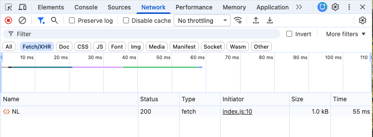
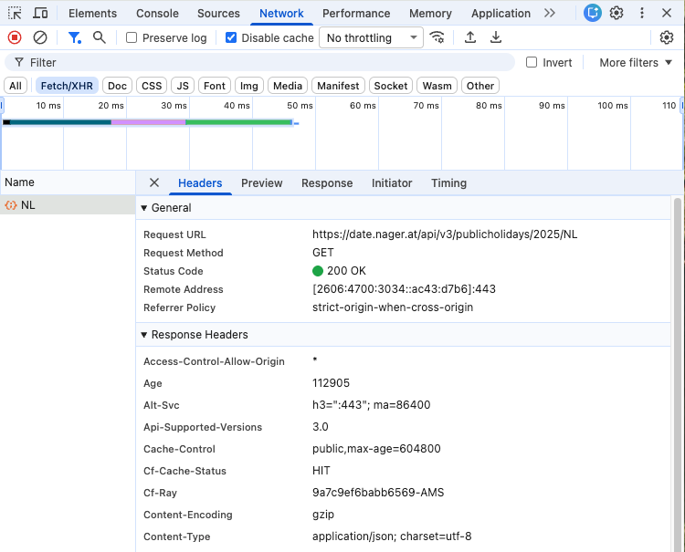

# Public Holidays

This application uses the **Nager.Date** public web API to display a list of public
holidays in the Netherlands for a selected year:

- API documentation: [Nager.Date API](https://date.nager.at/scalar/#api-version-3)

The application consists of the following files:

| File       | Description                                                              |
| ---------- | ------------------------------------------------------------------------ |
| index.html | The main HTML file that provides the HTML structure for the application. |
| styles.css | Contains all the styling for the application.                            |
| ui.js      | Handles all UI-related functionality.                                    |
| index.js   | The main application logic that handles API interactions.                |

Your job is to complete the function `loadHolidays()` in `services.js` as described below, following the code snippet.

```javascript
// import { renderHolidays, showError } from './ui.js';

function getRequest(url, onSuccess, onError) {
  // ... existing code ...
}

export function loadHolidays(year) {
  getRequest(
    `<url>`, //TODO: Replace <url> with the actual API endpoint
    (data) => {
      // TODO: Handle successful data retrieval
    },
    (error) => {
      // TODO: Handle errors
    }
  );
}
```

Complete the implementation as follows:

1. Complete the URL string for the Nager.Date API as was discussed in the Using APIs section of the learning material for this week. The URL should request the public holidays for the Netherlands (`NL`) for the year provided as the `year` parameter to the `loadHolidays()` function.

2. Complete the first arrow function, which acts as the `onSuccess` handler for `getRequest()`. It should take a single parameter that will receive the data obtained from the API if the GET request was successful. This will be a JavaScript object. Inside the function body, call the imported function `renderHolidays()` and pass the received object as a parameter.

3. Complete the second arrow function, which acts as the `onError` handler for `getRequest()`. It will receive a JavaScript `Error` object as its sole parameter if the GET request returns an error. Log this error as-is to the console. (The target audience for this technical error information is developers.)

   Then, call the imported `showError()` with a user-friendly error message.

> :exclamation: If you haven't already done so, install the VS Code [Live Server](https://marketplace.visualstudio.com/items?itemName=ritwickdey.LiveServer) extension before continuing.

When you are done, right-click the `index.html` file in the VS Code Explorer and select "Open with Live Server" to open it in the browser. You should get something similar to this:


Open the browser's Developer Tools by pressing <kbd>F12</kbd> on Windows or Linux or <kbd>Fn</kbd> + <kbd>F12</kbd> on a Mac. Then, select the Network tab, as shown below:


We are interested in network requests that we make in our code with `Fetch`, so let's activate the `Fetch/XHR` filter as shown in the screenshot.

Now press the **Load Holidays** button. If all is well, you should now see the holidays for the selected year displayed in the UI. In the network tab, you should see the request as in the screenshot below. (Note: you may see other requests in the network that are not related to this app but are caused by browser extensions that you may have installed. They are not important for our purpose.)



The request that we just made now appears in the network tab. From this, we can see the following:

| Field     | Value       | Description                                                |
| --------- | ----------- | ---------------------------------------------------------- |
| Name      | NL          | This is the last part of the endpoint URL path.            |
| Status    | 200         | The response status code: OK                               |
| Type      | fetch       | The request was a `fetch` request.                         |
| Initiator | index.js:10 | The request was initiated by the `index.js` file, line 10. |
| Size      | 1.0 kB      | The size of the response.                                  |
| Time      | 55 ms       | The turn-around time for the response, in milliseconds.    |

The colored bars in the timeline represent the timing and stages of each network request. They can be used to identify performance bottlenecks, but this is an advanced topic not relevant for our discussion here.

Next, click on the line of the network request. This will show more details for the request:



You can inspect the request and response **Headers**, **Preview** the returned content as parsed data, view the **Response** in its original format, and get more details about the **Initiator** of the request and about the **Timing**.

Let's finally try and find out how our application handles errors. One such error happens when the network is no longer available. We can simulate this as follows:

First, click the checkbox labelled **Disable cache**. We don't want the fetch to be served from the browser's cache, as this will not be reported as an error.

With the cache disabled, from the drop-down that currently shows **No throttling**, select **Offline**. As the name implies, this simulates the browser becoming offline.

Press the **Load Holidays** button again. You should now see a failed network request in developer tools. The UI should display the error message that you set up in the code.

That concludes this exercise. Don't forget to undo the changes we made to make the network offline.
